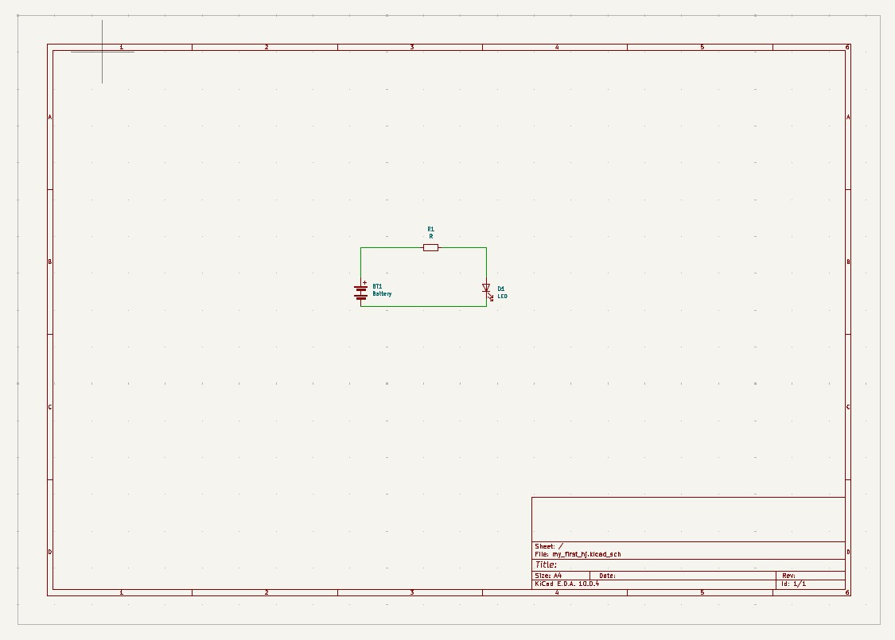
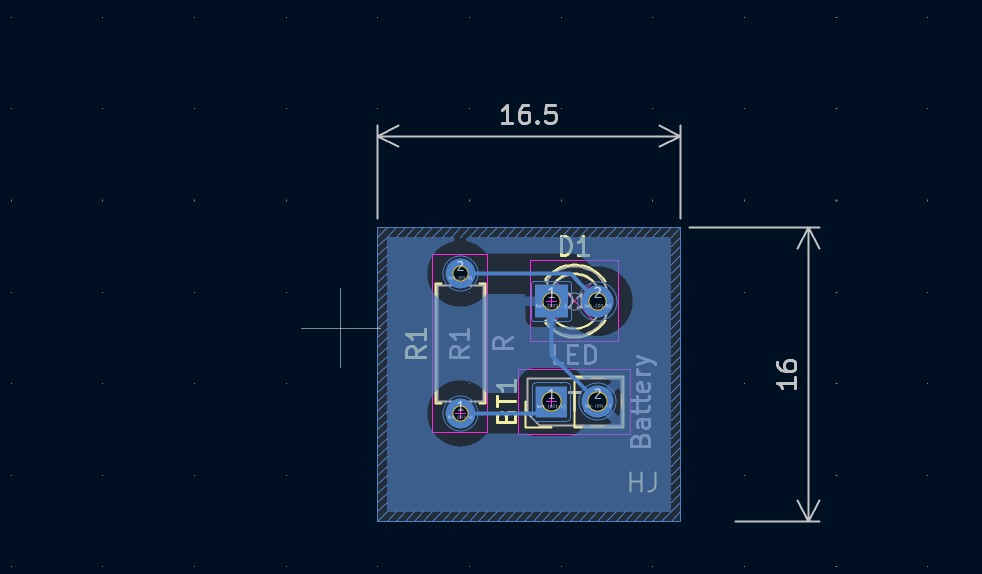
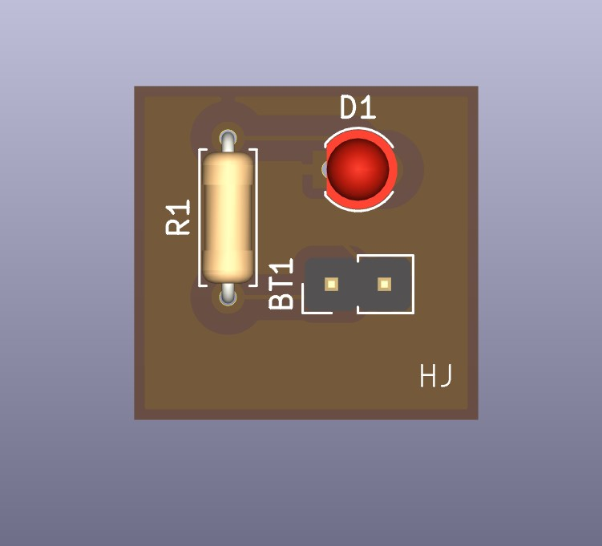
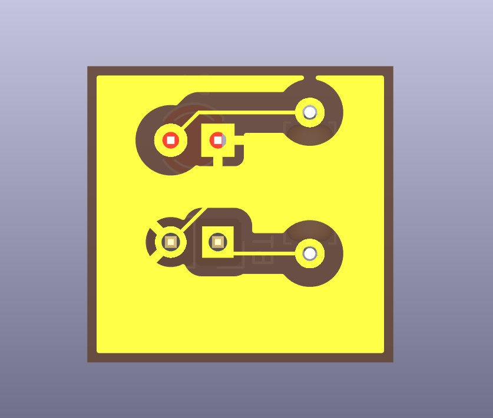

# LED-PCB-Kicad
My first PCB design using kicad
# LED PCB Design using KiCad

## Overview
This is my first PCB design created using KiCad.

## Components Used
- Battery Connector
- Resistor
- LED

## Software Used
- KiCad

## Project Images

### 1. Schematic

### 2. PCB Layout

### 3. 3D View

### 4. Copper Layer

## Learning Outcome
- Created a circuit schematic
- Designed a PCB layout
- Routed copper traces
- Visualized the PCB in 3D
